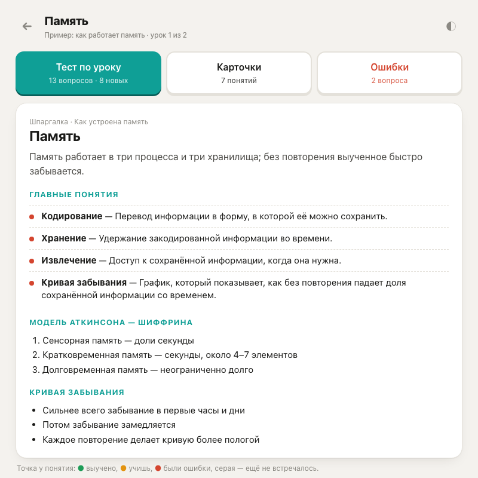

# study-quiz

Скилл для [Claude Code](https://claude.com/claude-code): превращает любые учебные материалы в личный тренажёр для запоминания. Подходят конспекты от руки, PDF, сохранённые страницы курса, статьи и просто текст. Получается квиз в 10 форматах, шпаргалки к урокам, флэшкарты, карта понятий и ежедневная сессия с интервальным повторением.

Тренажёр — одна HTML-страница: открывается двойным кликом, без сервера и регистрации, прогресс хранится в браузере.

<p>
  
  
</p>
<p>
  
  
</p>


## Зачем

Обычные квизы проверяют знания. Этот тренажёр помогает их **запомнить**:

- одно определение встречается в разных форматах, от простого к сложному: сначала узнаёшь, потом вспоминаешь сам;
- определения — дословно из материала, разборы развёрнутые, подсказки наводят, но не выдают ответ;
- без кейсов, расчётов, вопросов «с подвохом» и вопросов про сам курс;
- ошибки возвращаются завтра, выученное — через 3, 7, 16, 35 и 80 дней.

Правила составления вопросов собраны за реальный курс: каждое появилось из замечания «такой вопрос не помогает». Все правила — в [RULES.md](RULES.md).

## Что внутри тренажёра

| | |
|---|---|
| **На сегодня** | ~25 вопросов в день: повторения и новые пополам, карточки в конце |
| **10 типов вопросов** | соединить, выбрать, верно/неверно, разложить по группам, таблица с пропусками, схема (шаги, воронка, вложенные круги, сетка, дерево формулы), порядок, вписать слово, перечислить, вспомнить |
| **Шпаргалки** | урок на одном экране: суть, главные понятия, списки, формулы, сравнение; можно распечатать |
| **Флэшкарты** | термин ↔ определение, в обе стороны |
| **Карта курса** | все понятия и связи между ними; режим «пустая карта» — вспомни, что скрыто |
| **Свой тест** | любые уроки вперемешку, только ошибки или только новое, 20 / 40 / 80 / все |
| **Прогресс** | в браузере; экспорт и импорт в файл; по желанию — облако для телефона ([docs/CLOUD.md](docs/CLOUD.md)) |

## Установка

```bash
git clone https://github.com/<you>/study-quiz ~/.claude/skills/study-quiz
```

Нужны: Claude Code, Node.js и Python 3. Для разбора сохранённых HTML-страниц — `pip3 install lxml`. Для автотестов — Google Chrome или Chromium.

## Как пользоваться

Открой Claude Code в пустой папке для курса и напиши, например:

> сделай тренажёр по этим конспектам *(и приложи фото, PDF или текст)*

Claude создаст `trainer/`, перепишет материал в `notes/`, составит вопросы, понятия и шпаргалки, проверит всё автотестами и скажет, что получилось. Открой `trainer/index.html` двойным кликом.

Дальше:

- **«вот новые уроки»** — добавит их в тот же тренажёр; изменённые и удалённые уроки тоже найдёт сам;
- **«этот вопрос тупой»**, **«подсказка выдаёт ответ»** — поправит и запишет правило на будущее для всех тем;
- **«проверь меня по теме X»** — устный экзамен: 8–10 вопросов «объясни своими словами», итог и файл, который возвращает упущенное в «На сегодня».

### Материалы с платных курсов

Скилл не заходит на закрытые платформы и ничего с них не скачивает: пользовательские соглашения обычно это запрещают. Сохрани уроки сам — открой урок, прокрути до конца, «Сохранить как → Веб-страница, полностью» в папку `sources/`. Скилл проверит, что каждая страница сохранилась целиком, и скажет, какие пересохранить.

## Структура

```
SKILL.md              инструкция для Claude
RULES.md              правила вопросов, понятий и шпаргалок
docs/FORMAT.md        формат данных: 10 типов вопросов, понятия, связи, шпаргалки
docs/CLOUD.md         необязательная облачная копия (Cloudflare Pages + Access)
assets/trainer/       шаблон тренажёра с примером на теме «Как работает память»
assets/cloud/         функция синхронизации прогресса
examples/notes/       конспекты к примеру
scripts/              проверки и инструменты (запускаются из папки проекта)
```

Проект курса после первого запуска выглядит так:

```
sources/      исходники как есть (фото, PDF, сохранённые страницы)
notes/        чистый текст по урокам: <Название урока>.md
trainer/      тренажёр: index.html, config.js, quiz-data-<тема>.js, study-<тема>.js, img/
.study-quiz/  служебное: состояние для поиска изменений, журналы правок
```

## Скрипты

Все запускаются из папки проекта; `S=~/.claude/skills/study-quiz/scripts`.

```bash
python3 $S/extract_html.py sources/      # сохранённые страницы → notes/*.md + проверка целостности
python3 $S/sync.py                       # что изменилось: новые, изменённые, удалённые уроки
node    $S/validate.js                   # структура данных
node    $S/dumb_check.js --list          # признаки плохих вопросов
python3 $S/terms.py                      # все ли термины из конспектов попали в вопросы
python3 $S/e2e.py                        # автотест: весь банк вопросов в headless-Chrome
python3 $S/e2e_study.py                  # автотест: «На сегодня», шпаргалки, карточки, карта
python3 $S/screens.py                    # скриншоты экранов
node    $S/add_topic.js part.js          # вставить урок; --replace — заменить
node    $S/remove_topic.js <id урока>    # убрать урок (в archive/removed/)
```

## Лицензия

[MIT](LICENSE). Пример в `assets/trainer/` и `examples/` написан для этого репозитория. Материалы своих курсов в публичный доступ не выкладывай.
