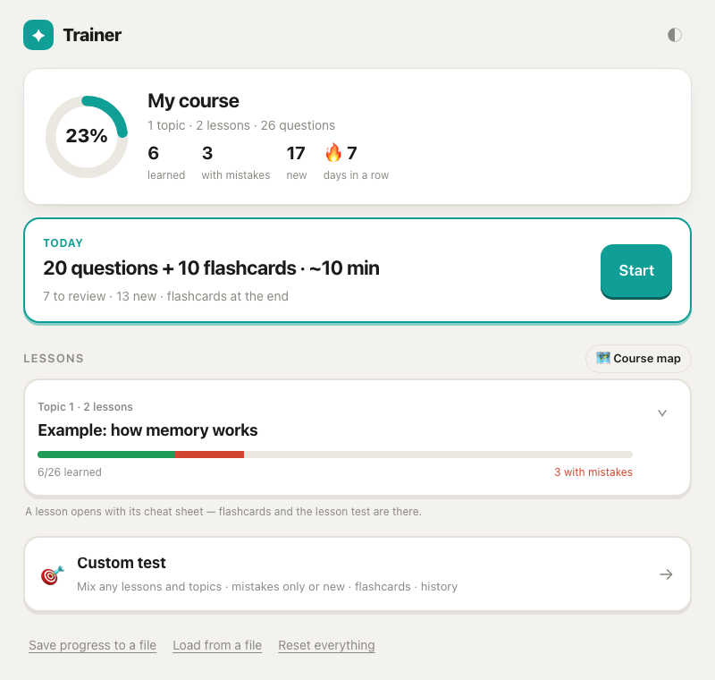
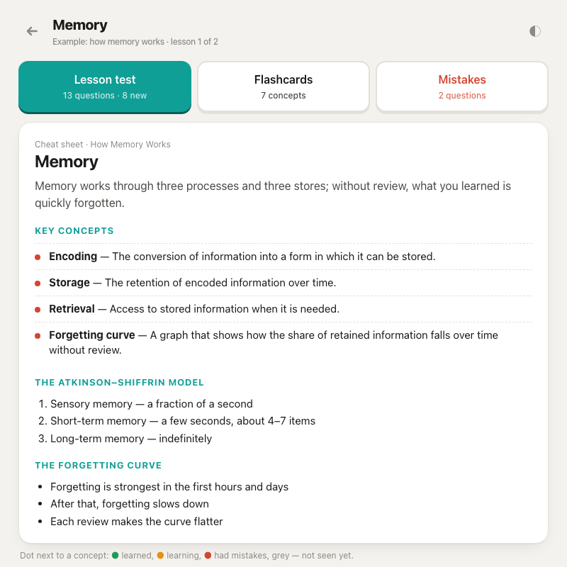
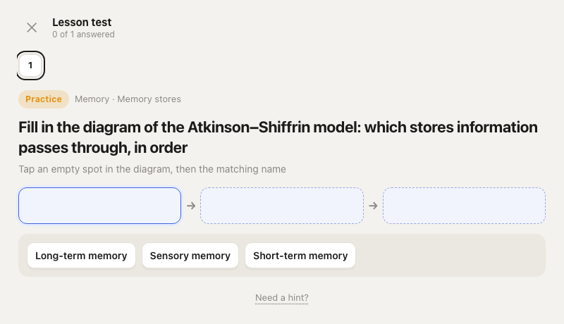
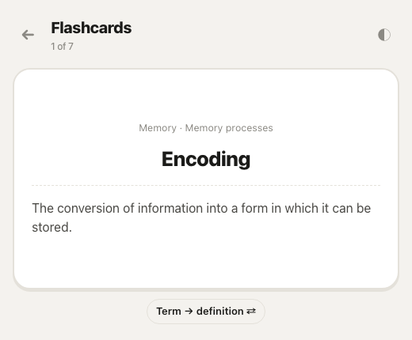
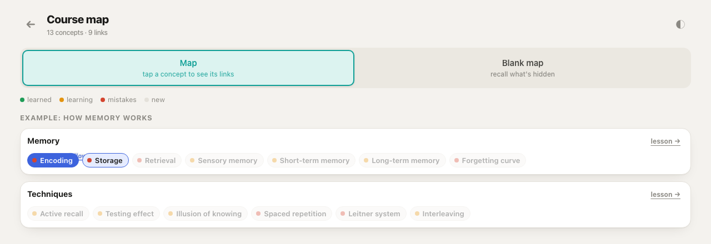

# study-quiz

**English** | [Русский](README.ru.md)

A skill for [Claude Code](https://claude.com/claude-code) that turns any study material into a personal memorization trainer. Handwritten notes, PDFs, saved course pages, articles or plain text all work. You get a quiz in 10 formats, a cheat sheet for every lesson, flashcards, a concept map and a daily spaced-repetition session.

The trainer is a single HTML page: open it with a double-click. No server, no sign-up; progress is stored in the browser.

> The interface is in English or Russian. Questions, cheat sheets and flashcards are written in the language of your material.

<p>
  
  
</p>
<p>
  
  
</p>


## Why

Ordinary quizzes test what you know. This trainer helps you **remember** it:

- each definition comes back in several formats, from easy to hard: first you recognize it, then you recall it yourself;
- definitions are quoted word for word from the material, explanations are detailed, hints point the way without giving the answer away;
- no case studies, calculations, trick questions or questions about the course itself;
- mistakes come back tomorrow; what you know comes back after 3, 7, 16, 35 and 80 days.

The question-writing rules were collected over a real course: each one came from a "this question doesn't help" remark. They are all in [RULES.md](RULES.md).

## What's in the trainer

| | |
|---|---|
| **Today** | ~25 questions a day: half reviews, half new, flashcards at the end |
| **10 question types** | match, multiple choice, true/false, sort into groups, table with blanks, diagram (steps, funnel, nested circles, grid, formula tree), order, fill in the word, list, recall |
| **Cheat sheets** | a lesson on one screen: the gist, key concepts, lists, formulas, comparisons; printable |
| **Flashcards** | term ↔ definition, both ways |
| **Course map** | all concepts and the links between them; "blank map" mode — recall what's hidden |
| **Custom test** | any lessons mixed, mistakes only or new only, 20 / 40 / 80 / all |
| **Progress** | in the browser; export and import to a file; optionally a cloud copy for your phone ([docs/CLOUD.md](docs/CLOUD.md)) |

## Install

```bash
git clone https://github.com/uniquearina/study-quiz ~/.claude/skills/study-quiz
```

Requires Claude Code, Node.js and Python 3. For saved HTML pages: `pip3 install lxml`. For pictures from photos and PDFs: `pip3 install pillow pymupdf`. For the automated tests: Google Chrome or Chromium.

## Usage

Open Claude Code in an empty folder for your course and write, for example:

> make a trainer from these notes *(and attach photos, PDFs or text)*

Claude creates `trainer/`, transcribes the material into `notes/`, writes questions, concepts and cheat sheets, checks everything with automated tests and tells you what it made. Open `trainer/index.html` with a double-click.

After that:

- **"here are new lessons"** — adds them to the same trainer; it also finds changed and removed lessons by itself;
- **"this question is dumb"**, **"the hint gives the answer away"** — fixes it and records a rule for all topics from now on;
- **"quiz me on topic X"** — an oral exam: 8–10 "explain in your own words" questions, a summary, and a file that brings what you missed back into Today.

### Several subjects

One trainer is one subject: its own Today session (~25 questions a day), progress, map and cheat sheets. For several subjects, use one parent folder:

1. Create a folder, e.g. `~/Study/`, and open Claude Code in it.
2. Drop in the material for all subjects at once, mixed is fine, and write "make trainers from these materials".
3. Claude shows which files it assigned to which subject, asks about unclear ones and offers a choice: a separate trainer per subject or one shared trainer with subjects as topics. For big subjects or exams at different times, pick separate trainers.
4. You get:
   ```
   ~/Study/
     index.html   ← hub: all subjects, how many for today, streak
     Anatomy/     sources/ notes/ trainer/
     History/     sources/ notes/ trainer/
     Chemistry/   sources/ notes/ trainer/
   ```
5. Bookmark `~/Study/index.html` — every subject opens from there.

After that, open Claude Code in `~/Study/` and write "here are new lessons", even if they are for different subjects: Claude sorts them into the right trainers and updates the hub. Working inside one subject folder, e.g. `~/Study/Chemistry/`, works too.

The "for today" counters on the hub show in Chrome and Edge. In other browsers the hub just links to the trainers; progress is still shown inside each one.

### What to put where

Put your sources in `sources/` inside the course folder. You can also just attach files in the chat and Claude will move them there.

| Material | What to put |
|---|---|
| PDF (textbook, handout, slides) | the whole file: `sources/textbook.pdf`. If you only need part of it, say which: "chapters 3–5, pp. 40–95" |
| Handwritten notes | photos or scans in page order: `sources/lecture-1/01.jpg`, `02.jpg`… |
| Word, PowerPoint | `.docx` / `.pptx` as is |
| Online course pages | "Save as → Web page, complete" (see below) |
| Article, public link | paste the link in the chat |
| Text | paste it in the chat or save to `sources/*.txt` |

It's easiest when one file or subfolder is one lesson, with a number in the name: `01 Introduction.pdf`. If the course has a table of contents, attach a screenshot and Claude will check nothing is missing.

### Photos of handwritten notes

Claude reads handwriting and joins several photos of one lecture into a single text. For best results:

- one lecture, one subfolder: `sources/Lecture 3/`. If you can't sort them, just send everything: Claude will sort by dates and headings on the pages;
- shoot pages in order, one per photo, straight and in good light. Claude gets the order from file names or capture time;
- Claude doesn't guess what it can't read. It sends one list like "photo 3: 'retroactive' or 'reproductive'?" and asks you to retake only the bad photos.

Diagrams and arrows in the margins make it into the trainer too, as tables, diagrams and "put in place" questions.

### Pictures from textbooks

Photos of textbook pages, posters and PDFs can have their pictures cut out and put into the quiz:

- a labelled diagram (organ layers, plants, a map) becomes a "label the diagram" question: the labels are covered with numbers, and the full picture with labels is shown in the explanation;
- a drawing that gives the answer away goes only into the explanation;
- tables, formulas and text-only flowcharts are retyped instead, so you can fill them in as tables and diagrams;
- duplicates (the same page shot twice) are counted once, and anything that isn't study material is skipped — Claude will ask about it.

Shoot the page straight on; if a figure is small, take a separate close-up of it.

### If the material isn't split into topics

That's fine. For one big PDF, continuous notes or a pile of files, Claude finds the boundaries by headings and changes of subject, splits the text into lessons of 10–20 questions each and groups the lessons into topics. Before writing questions it shows a plan: "topic → lesson → source (pages) → what it's about". You can adjust it ("merge 3 and 4", "rename this"). Work continues only after your "ok".

### If you add material in parts

For example, 5 lectures first, then one a week. Each time:

1. Put the new lecture in `sources/` next to the old ones. Don't delete the old ones: a missing file looks like a removed lesson.
2. Open Claude Code in the same course folder and write **"here are new lessons"**.
3. Claude compares the sources with the trainer and writes questions only for what's new. A lecture that continues an existing topic goes into that topic; a new topic gets a new section.

Progress is kept: old questions don't change, and new ones join Today alongside your reviews. If you edit or extend an old lecture and save it again, the skill notices and updates only the affected questions.

### Paid course materials

The skill doesn't log in to closed platforms or download anything from them: their terms usually forbid it. Save the lessons yourself — open a lesson, scroll to the end, "Save as → Web page, complete" into `sources/`. The skill checks that each page saved completely and tells you which to save again.

## Layout

```
SKILL.md              instructions for Claude
RULES.md              rules for questions, concepts and cheat sheets
docs/FORMAT.md        data format: 10 question types, concepts, links, cheat sheets
docs/CLOUD.md         optional cloud copy (Cloudflare Pages + Access)
assets/trainer/       trainer template (interface: English or Russian)
assets/cloud/         progress sync function
examples/en/          sample topic "How memory works": notes and trainer data
examples/ru/          the same sample in Russian
scripts/              checks and tools (run from the project folder)
```

A course project after the first run:

```
sources/      sources as is (photos, PDFs, saved pages)
notes/        clean text per lesson: <Lesson title>.md
trainer/      the trainer: index.html, config.js, quiz-data-<topic>.js, study-<topic>.js, img/
.study-quiz/  internal: state for change detection, edit logs
```

## Scripts

All run from the project folder; `S=~/.claude/skills/study-quiz/scripts`.

```bash
python3 $S/extract_html.py sources/      # saved pages → notes/*.md + completeness check
python3 $S/sync.py                       # what changed: new, changed, removed lessons
node    $S/validate.js                   # data structure
node    $S/dumb_check.js --list          # signs of bad questions
python3 $S/terms.py                      # did every term from the notes make it into questions
python3 $S/e2e.py                        # test: the whole question bank in headless Chrome
python3 $S/e2e_study.py                  # test: Today, cheat sheets, flashcards, map
python3 $S/crop_image.py grid|crop|pdf|dupes  # pictures from photos and PDFs → trainer/img/
python3 $S/hub.py                        # hub page for several subjects (run in the parent folder)
python3 $S/screens.py                    # screenshots
node    $S/add_topic.js part.js          # insert a lesson; --replace to replace
node    $S/remove_topic.js <lesson id>   # remove a lesson (to archive/removed/)
```

## License

[MIT](LICENSE). The sample in `examples/` was written for this repository. Don't publish materials from your own courses.
