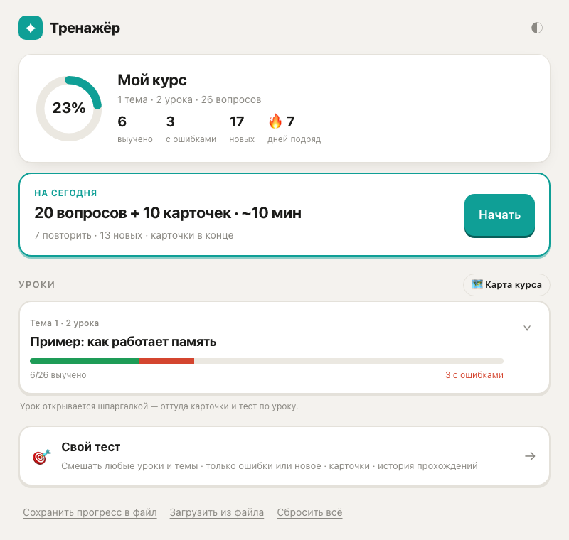
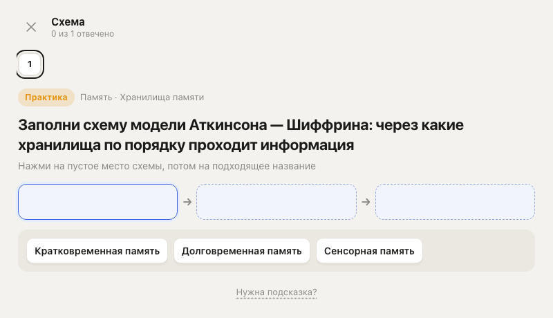
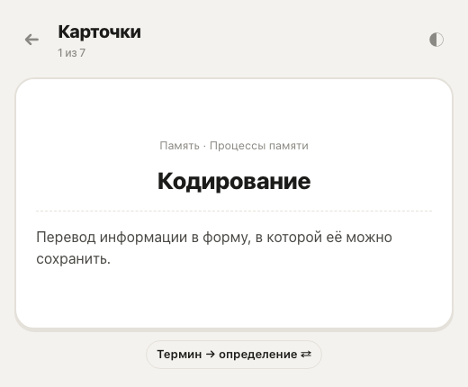
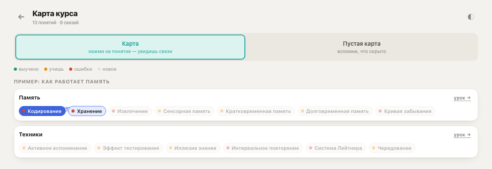

# study-quiz

[English](README.md) | **Русский**

Скилл для [Claude Code](https://claude.com/claude-code): превращает любые учебные материалы в личный тренажёр для запоминания. Подходят конспекты от руки, PDF, сохранённые страницы курса, статьи и просто текст. Получается квиз в 10 форматах, шпаргалки к урокам, флэшкарты, карта понятий и ежедневная сессия с интервальным повторением.

Тренажёр — одна HTML-страница: открывается двойным кликом, без сервера и регистрации, прогресс хранится в браузере. Интерфейс на русском или английском, вопросы — на языке материала.

<p>
  
  
</p>
<p>
  
  
</p>


## Зачем

Обычные квизы проверяют знания. Этот тренажёр помогает их **запомнить**:

- одно определение встречается в разных форматах, от простого к сложному: сначала узнаёшь, потом вспоминаешь сам;
- определения — дословно из материала, разборы развёрнутые, подсказки наводят, но не выдают ответ;
- без кейсов, расчётов, вопросов «с подвохом» и вопросов про сам курс;
- ошибки возвращаются завтра, выученное — через 3, 7, 16, 35 и 80 дней.

Правила составления вопросов собраны за реальный курс: каждое появилось из замечания «такой вопрос не помогает». Все правила — в [RULES.md](RULES.md) (на английском: этот файл читает Claude).

## Что внутри тренажёра

| | |
|---|---|
| **На сегодня** | ~25 вопросов в день: повторения и новые пополам, карточки в конце |
| **10 типов вопросов** | соединить, выбрать, верно/неверно, разложить по группам, таблица с пропусками, схема (шаги, воронка, вложенные круги, сетка, дерево формулы), порядок, вписать слово, перечислить, вспомнить |
| **Шпаргалки** | урок на одном экране: суть, главные понятия, списки, формулы, сравнение; можно распечатать |
| **Флэшкарты** | термин ↔ определение, в обе стороны |
| **Карта курса** | все понятия и связи между ними; режим «пустая карта» — вспомни, что скрыто |
| **Свой тест** | любые уроки вперемешку, только ошибки или только новое, 20 / 40 / 80 / все |
| **Прогресс** | в браузере; экспорт и импорт в файл; по желанию — облако для телефона ([docs/CLOUD.ru.md](docs/CLOUD.ru.md)) |

## Установка

```bash
git clone https://github.com/uniquearina/study-quiz ~/.claude/skills/study-quiz
```

Нужны: Claude Code, Node.js и Python 3. Для разбора сохранённых HTML-страниц — `pip3 install lxml`. Для картинок с фото и из PDF — `pip3 install pillow pymupdf`. Для автотестов — Google Chrome или Chromium.

## Как пользоваться

Открой Claude Code в пустой папке для курса и напиши, например:

> сделай тренажёр по этим конспектам *(и приложи фото, PDF или текст)*

Claude создаст `trainer/`, перепишет материал в `notes/`, составит вопросы, понятия и шпаргалки, проверит всё автотестами и скажет, что получилось. Открой `trainer/index.html` двойным кликом.

Дальше:

- **«вот новые уроки»** — добавит их в тот же тренажёр; изменённые и удалённые уроки тоже найдёт сам;
- **«этот вопрос тупой»**, **«подсказка выдаёт ответ»** — поправит и запишет правило на будущее для всех тем;
- **«проверь меня по теме X»** — устный экзамен: 8–10 вопросов «объясни своими словами», итог и файл, который возвращает упущенное в «На сегодня».

### Несколько предметов

Один тренажёр — один предмет: у него своё «На сегодня» (около 25 вопросов в день), свой прогресс, своя карта и шпаргалки. Если предметов несколько, заведи для них общую папку:

1. Создай папку, например `~/Study/`, и открой в ней Claude Code.
2. Закинь материалы всех предметов сразу, можно вперемешку, и напиши «сделай тренажёры по этим материалам».
3. Claude покажет, какие файлы к какому предмету отнёс, спросит про непонятные и предложит на выбор: отдельный тренажёр на каждый предмет или один общий, где предметы — темы. Если предметы большие или экзамены по ним в разное время, выбирай отдельные.
4. Получится так:
   ```
   ~/Study/
     index.html   ← общая страница: все предметы, сколько на сегодня, дни подряд
     sources/     ← сюда можно класть файлы вперемешку, Claude разложит по предметам
     Анатомия/    sources/ notes/ trainer/
     История/     sources/ notes/ trainer/
     Химия/       sources/ notes/ trainer/
   ```
5. Добавь `~/Study/index.html` в закладки браузера: с неё открывается любой предмет.

Дальше открывай Claude Code в `~/Study/` и пиши «вот новые уроки», даже если они по разным предметам: Claude сам разложит их по тренажёрам и обновит общую страницу. Можно работать и в папке одного предмета, например `~/Study/Химия/`.

Счётчики «на сегодня» на общей странице видны в Chrome и Edge. В других браузерах страница просто ведёт в тренажёры, а прогресс по-прежнему виден внутри каждого.

### Какие материалы и куда класть

Исходники лежат в папке `sources/` внутри папки курса. Положить их туда можно двумя способами, оба работают:

- **приложить файлы в чат** — Claude сам перенесёт их в `sources/`;
- **положить в `sources/` вручную** (через Finder, проводник или VS Code) в любой структуре, а потом написать «вот новые уроки» или «обнови тренажёр». Claude сам посмотрит, что в `sources/` появилось, что пересохранено и что пропало, и спросит про файлы, которые не понял.

Старые исходники не удаляй: по ним Claude отличает новые файлы от уже разобранных.

| Материал | Что положить |
|---|---|
| PDF (учебник, методичка, слайды) | файл целиком: `sources/учебник.pdf`. Если нужна только часть, напиши страницы: «главы 3–5, с. 40–95» |
| Конспекты от руки | фото или сканы по порядку страниц: `sources/лекция-1/01.jpg`, `02.jpg`… |
| Word, PowerPoint | `.docx` / `.pptx` как есть |
| Страницы онлайн-курса | «Сохранить как → Веб-страница, полностью» (см. ниже) |
| Статья, открытая ссылка | ссылку прямо в чат |
| Текст | вставь в чат или сохрани в `sources/*.txt` |

Удобнее всего, когда один файл или подпапка соответствует одному уроку, а в названии есть номер: `01 Введение.pdf`. Если есть оглавление курса, приложи его скриншот, и Claude проверит, что ничего не пропущено.

### Фото рукописных конспектов

Claude расшифровывает почерк и склеивает несколько фото одной лекции в один текст. Чтобы было точнее:

- одна лекция — одна подпапка: `sources/Лекция 3/`. Если так разложить не получится, просто скинь всё подряд: Claude разберёт по датам и заголовкам на листах;
- снимай страницы по порядку, по одной на кадр, ровно и при хорошем свете. Порядок Claude определит по имени файла или по времени съёмки;
- то, что не удалось прочитать, Claude не угадывает. Он пришлёт один список вроде «фото 3: тут „ретроактивная“ или „репродуктивная“?» и попросит переснять только плохие фото.

Схемы и стрелки с полей тоже попадут в тренажёр: в виде таблиц, схем и вопросов «расставь по местам».

### Картинки из учебников

С фото страниц учебника, плакатов и из PDF можно вырезать рисунки и вставить их в квиз:

- схема с подписями (слои органа, растения, карта) становится вопросом «подпиши схему»: подписи закрываются номерами, а полная картинка с подписями показывается в разборе;
- рисунок, по которому сразу виден ответ, идёт только в разбор;
- таблицы, формулы и схемы из одного текста перенабираются: их удобнее заполнять как таблицу или схему;
- повторы (одна страница, снятая дважды) считаются один раз, а то, что не похоже на учебный материал, Claude пропустит и спросит про него.

Снимай страницу ровно; если рисунок мелкий, сфотографируй его отдельно крупным планом.

### Если материал не разделён на темы

Это не страшно. Если у тебя одна большая PDF, сплошной конспект или файлы вперемешку, Claude сам найдёт границы по заголовкам и смене темы. Потом он разобьёт текст на уроки на 10–20 вопросов каждый и соберёт уроки в темы. Перед тем как делать вопросы, он покажет план: «тема → урок → откуда (страницы) → о чём». План можно поправить («объедини 3 и 4», «назови иначе»). Работа продолжится только после твоего «ок».

### Если загружаешь по частям

Например, сначала 5 лекций, потом по одной в неделю. Каждый раз:

1. Положи новую лекцию в `sources/` рядом со старыми. Старые не удаляй: исчезнувший файл скилл примет за удалённый урок.
2. Открой Claude Code в той же папке курса и напиши **«вот новые уроки»**.
3. Claude сравнит исходники с тренажёром и сделает вопросы только для нового. Если лекция продолжает уже пройденную тему, она попадёт туда же. Если это новая тема, в тренажёре появится новый раздел.

Прогресс сохраняется: старые вопросы не меняются, а новые встанут в «На сегодня» вместе с повторениями. Если ты исправишь или дополнишь старую лекцию и пересохранишь её, скилл это заметит и обновит только изменённые вопросы.

### Материалы с платных курсов

Скилл не заходит на закрытые платформы и ничего с них не скачивает: пользовательские соглашения обычно это запрещают. Сохрани уроки сам — открой урок, прокрути до конца, «Сохранить как → Веб-страница, полностью» в папку `sources/`. Скилл проверит, что каждая страница сохранилась целиком, и скажет, какие пересохранить.

## Структура

```
SKILL.md              инструкция для Claude (англ.)
RULES.md              правила вопросов, понятий и шпаргалок (англ.)
docs/FORMAT.md        формат данных: 10 типов вопросов, понятия, связи, шпаргалки (англ.)
docs/CLOUD.ru.md      необязательная облачная копия (Cloudflare Pages + Access)
assets/trainer/       шаблон тренажёра (интерфейс на английском или русском)
assets/cloud/         функция синхронизации прогресса
examples/en/          пример «How memory works»: конспекты и данные тренажёра
examples/ru/          тот же пример на русском: «Как работает память»
scripts/              проверки и инструменты (запускаются из папки проекта)
```

Проект курса после первого запуска выглядит так:

```
sources/      исходники как есть (фото, PDF, сохранённые страницы)
notes/        чистый текст по урокам: <Название урока>.md
trainer/      тренажёр: index.html, config.js, quiz-data-<тема>.js, study-<тема>.js, img/
.study-quiz/  служебное: состояние для поиска изменений, журналы правок
```

## Скрипты

Все запускаются из папки проекта; `S=~/.claude/skills/study-quiz/scripts`.

```bash
python3 $S/extract_html.py sources/      # сохранённые страницы → notes/*.md + проверка целостности
python3 $S/sync.py                       # что изменилось: новые, изменённые, удалённые уроки
node    $S/validate.js                   # структура данных
node    $S/dumb_check.js --list          # признаки плохих вопросов
python3 $S/terms.py                      # все ли термины из конспектов попали в вопросы
python3 $S/e2e.py                        # автотест: весь банк вопросов в headless-Chrome
python3 $S/e2e_study.py                  # автотест: «На сегодня», шпаргалки, карточки, карта
python3 $S/crop_image.py grid|crop|pdf|dupes  # картинки с фото и из PDF → trainer/img/
python3 $S/hub.py                        # общая страница для нескольких предметов (из общей папки)
python3 $S/screens.py                    # скриншоты экранов
node    $S/add_topic.js part.js          # вставить урок; --replace — заменить
node    $S/remove_topic.js <id урока>    # убрать урок (в archive/removed/)
```

## Лицензия

[MIT](LICENSE). Пример в `examples/` написан для этого репозитория. Материалы своих курсов в публичный доступ не выкладывай.
